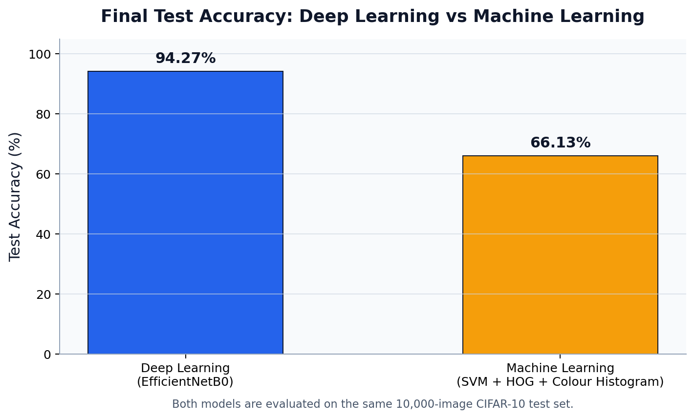

## CIFAR-10 Image Classification — Deep Learning vs Machine Learning

Transfer-learning image classifier that fine-tunes three ImageNet-pretrained CNNs on CIFAR-10 and benchmarks them against a classical machine-learning baseline. The deep learning approach reaches **up to ~96% test accuracy**, roughly **28 points above** the SVM + HOG pipeline.

> University group project. This repository contains the **Deep Learning** notebook
> (`development_DL.ipynb`); the classical ML counterpart lives in `development_ML.ipynb`.

**My role:** authored all of the deep learning modelling section (Section 2) end to end; the data/augmentation pipeline, the shared two-phase training utilities, all three fine-tuned architectures with their per-model hyperparameter recipes, and the training/validation analysis (loss and accuracy curves, and validation confusion matrices).

---

## Overview

The goal was to classify the 10 CIFAR-10 object categories and to answer a practical
question: *how much does deep learning actually buy you over a well-engineered classical
ML pipeline on the same data?* Both approaches are trained and evaluated on the identical
train/test split, so the final comparison is fair.

The deep learning side uses **transfer learning**: instead of training a CNN from scratch,
three ImageNet-pretrained backbones are fine-tuned to CIFAR-10 with a two-phase strategy.

## Dataset

- **CIFAR-10**: 60,000 colour images at 32×32 pixels across 10 classes (airplane,
  automobile, bird, cat, deer, dog, frog, horse, ship, truck).
- Split: **45,000 train / 5,000 validation / 10,000 test** (validation carved from the official 50k training set with a fixed seed; the 10k test set is sealed until final evaluation and never used for model selection).
- Images are upscaled to **224×224** to match the resolution the ImageNet backbones were trained on, and normalised using channel statistics computed from the training set only.

## Approach

**Two-phase transfer learning** applied to every model:

1. **Warm-up**: backbone frozen, only the new 10-class classification head trains.
2. **Fine-tune**: all layers unfrozen and trained at a lower learning rate.

Each architecture gets its own tuned training recipe rather than a shared one:

| Technique | Detail |
|---|---|
| Optimiser | AdamW (decoupled weight decay) |
| LR schedule | Cosine annealing over the fine-tune phase |
| Regularisation | Label smoothing (0.1), per-model weight decay, dropout on VGG16's large head |
| Stability | Gradient clipping (max-norm 1.0), early stopping (patience 5) |
| Augmentation | RandomCrop (pad 4) + RandomHorizontalFlip + ColorJitter; training only |
| Reproducibility | Fixed seeds across `random`, `numpy`, and `torch` |

Per-model hyperparameters (fine-tune LR, weight decay, dropout, and epoch count) were set individually to reflect each architecture's behaviour.

## Models Compared

| Model | Why it's here |
|---|---|
| **VGG16** | Plain deep CNN: strong, simple baseline |
| **ResNet-34** | Skip connections mitigate vanishing gradients |
| **EfficientNet-B0** | Compound scaling: best accuracy-per-parameter |

## Results

Trained on a single Colab **Tesla T4** GPU.

| Model | Best Val Acc | Test Acc | Params | 
|---|---|---|---|
| VGG16 | 93.68% | 92.78% | 134.3M | 
| ResNet-34 | 97.64% | **96.27%** | 21.3M | 
| EfficientNet-B0 | **97.74%** | 94.27% | **4.0M** | 

The final model is chosen by **validation accuracy** (the test set is touched only once, for
final reporting), selecting **EfficientNet-B0**, which lands at **94.27% test accuracy**
while being by far the smallest model at 4M parameters.

### Deep Learning vs Machine Learning

| Metric | Deep Learning (EfficientNet-B0) | Machine Learning (SVM + HOG + Colour Histogram) |
|---|---|---|
| Test accuracy | **94.27%** | 66.13% |
| Feature engineering | Automatic (learned by the CNN) | Manual (HOG + colour histograms) |
| Model size | 4.0M params | Lightweight |
| Interpretability | Low | High |

**Takeaway:** deep learning wins by learning task-specific features end-to-end, at the cost
of far more compute and less interpretability. For low-compute or low-data settings, the
classical pipeline remains a reasonable, faster alternative.

## Notebook Structure (`development_DL.ipynb`)

- **0–1. Setup & preprocessing**: download CIFAR-10, inspect, normalise, prepare labels.
- **2. Deep learning models**: data pipeline, shared training utilities, and the three
  fine-tuned architectures, with loss/accuracy curves and validation confusion matrices.
- **3. Evaluation & comparison**: sealed test-set evaluation, val-vs-test generalisation
  gap, confusion matrix, sample predictions, and the DL-vs-ML per-class comparison.

## Tech Stack

Python, PyTorch, torchvision, scikit-learn, NumPy, pandas, Matplotlib, seaborn

